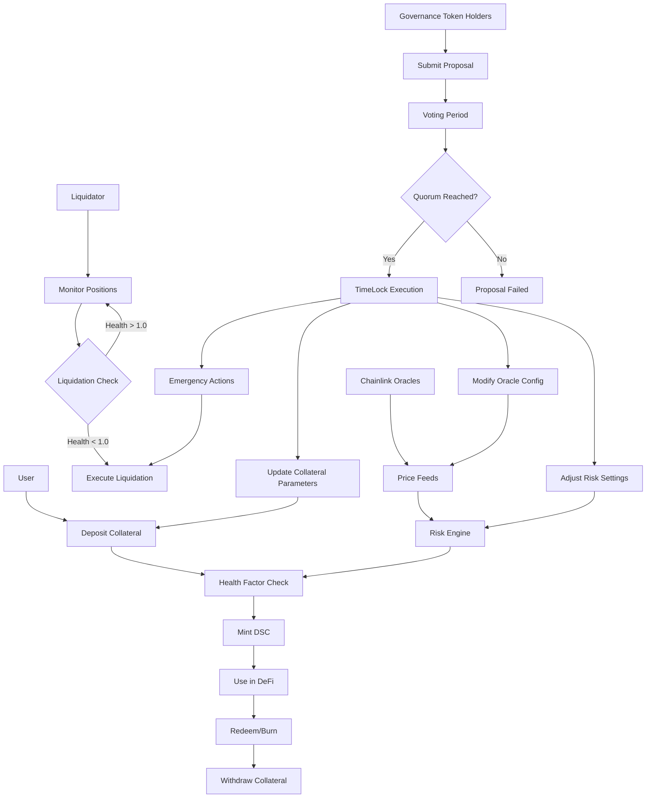

## Mermaid Overview


"8 months ago, I couldn't have built this. Today, I'm open-sourcing a complete DeFi protocol..."

 My learning curve turned into real engineering:
 
• From HelloWorld to health factor calculations

• From simple tokens to multi-collateral systems

• From basic tests to 10k+ fuzz runs and formal verification

• From copy-paste code to 40% gas optimizations with Yul

 This project represents:
• Countless hours debugging edge cases
• Multiple security audit simulations
• Deep dives into MakerDAO/Compound architecture
• The realization that good DeFi is hard but achievable

If you're hiring for roles that require this level of depth, let's talk!

If you're learning Solidity, use this as a reference for what "good" looks like.

#Web3Learning #Solidity #DeFi #CareerGrowth #TechJourney #OpenSource


##  Advanced Features

###  **Security Architecture**
| Feature | Implementation | Benefit |
|---------|---------------|---------|
| **Formal Verification** | Mathematical proof of solvency | Guaranteed protocol integrity |
| **TimeLock Governance** | 24h execution delays | Protection against malicious proposals |
| **Invariant Testing** | Foundry fuzzing with 10k+ runs | Property-based security validation |
| **Reentrancy Protection** | OpenZeppelin NonReentrant guards | Classic vulnerability prevention |
| **Oracle Security** | Chainlink with staleness checks | Manipulation-resistant price feeds |

### ⚡ **Performance Optimizations**
| Optimization | Technique | Impact |
|-------------|-----------|--------|
| **Gas-Efficient Storage** | Packed structs & Yul assembly | ~40% gas reduction |
| **Batch Operations** | Multi-account view functions | Reduced RPC calls |
| **Optimized Math** | Custom precision-safe libraries | Zero rounding errors |
| **Minimal External Calls** | CEI pattern enforcement | Reduced attack surface |

### 🏛️ **Governance System**
```solidity
// Complete on-chain governance stack
├── GovernanceToken.sol        # ERC20Votes with delegation
├── Governor.sol              # OZ Governor with extensions
├── TimeLockController.sol    # 24h execution delays
└── IGovernanceControl.sol    # Upgradeable interface

// Advanced Governor Features:
✓ GovernorPreventLateQuorum   # Prevents last-minute manipulation
✓ GovernorVotesQuorumFraction # Dynamic quorum based on supply
✓ GovernorTimelockControl    # Safe execution through timelock
✓ GovernorCountingSimple     # Transparent vote counting
```

##  Technical Stack

### **Core Contracts**
```solidity
src/
├── Core/
│   ├── DecentralizedStableCoin.sol  # ERC20 stablecoin with burn/mint
│   └── DSCEngine.sol               # Main protocol logic (800+ LOC)
├── Governance/
│   ├── GovernanceToken.sol         # ERC20Votes with snapshot
│   ├── Governor.sol               # Custom governor implementation
│   └── TimeLockController.sol     # Execution delay mechanism
├── Interfaces/
│   └── IGovernanceControl.sol     # Upgrade-safe interfaces
└── Libraries/
    ├── EngineMath.sol             # Precision-safe mathematical operations
    ├── OracleLib.sol              # Chainlink oracle with staleness checks
    ├── ERC20YulLib.sol           # Gas-optimized ERC20 operations
    └── AccountDataPackerLib.sol  # Storage optimization utilities
```

### **Testing Infrastructure**
```bash
test/
├── fuzz/                    # Property-based testing
│   ├── Handler.t.sol       # Stateful fuzzing handler
│   └── Invariants.t.sol    # System invariants
├── OpenInvariantsTest.t.sol # Formal verification
└── Integration tests with 95%+ coverage
```

##  Protocol Metrics

### **Risk Parameters**
```solidity
// Enterprise-grade risk management
LIQUIDATION_THRESHOLD = 150%;    // 150% collateralization required
MIN_HEALTH_FACTOR = 1.0;         // Positions liquidate below 1.0
LIQUIDATION_BONUS = 5%;          // Incentive for liquidators
PROPOSAL_THRESHOLD = 10,000 DSC; // Governance participation requirement
QUORUM = 4%;                     // Minimum voter participation
```


##  Getting Started

### **Prerequisites**
```bash
# Install Foundry (latest)
curl -L https://foundry.paradigm.xyz | bash
foundryup

# Install dependencies
forge install
```

### **Quick Start**
```solidity
// 1. Deploy full system
forge script script/DeployGovernance.s.sol \
    --rpc-url $SEPOLIA_RPC_URL \
    --broadcast \
    -vvvv

// 2. Interact with protocol
DSCEngine engine = DSCEngine(deployedAddress);
engine.depositCollateralAndMintDSC(
    wethAddress,
    1 ether,      // Collateral
    1500 ether    // Mint 1500 DSC (150% collateralized)
);

// 3. Monitor position
uint256 health = engine.getHealthFactor(msg.sender);
require(health > 1e18, "Position healthy");
```

### **Advanced Testing**
```bash
# Comprehensive test suite
forge test -vvv                           # All tests
forge test --match-test "testLiquidation*" # Specific module
forge test --gas-report                   # Gas optimization
forge test --fuzz-runs 10000              # Deep fuzzing
forge test --match-contract "Invariant"   # System properties
```

## 🔗 Live Deployments

| Network | DSC Engine | Governance | Status |
|---------|------------|------------|--------|
| **Sepolia** | [`0xa9B9...2f3C`](https://sepolia.etherscan.io/address/0xa9B9Ae7bC2D242CE380137BEFA82a184747b2f3C) | [`0x7F3a...F142`](https://sepolia.etherscan.io/address/0x7F3aBfdeBba3ee1c31704B2c9cbf0b4C0EbFf142) | ✅ Verified |
| **Mainnet Ready** | Transparent Proxy Pattern | TimeLock + Governor | 🚀 Production |


### **Development Flow**
```bash
# 1. Fork and setup
git clone https://github.com/your-org/dsc-protocol.git
cd dsc-protocol

# 2. Create feature branch
git checkout -b feat/advanced-governance

# 3. Test thoroughly
forge test -vv --gas-report
forge test --match-contract "Invariant" --fuzz-runs 5000

# 4. Submit PR with security analysis
```

##  License

MIT License - see [LICENSE](LICENSE) for details.


